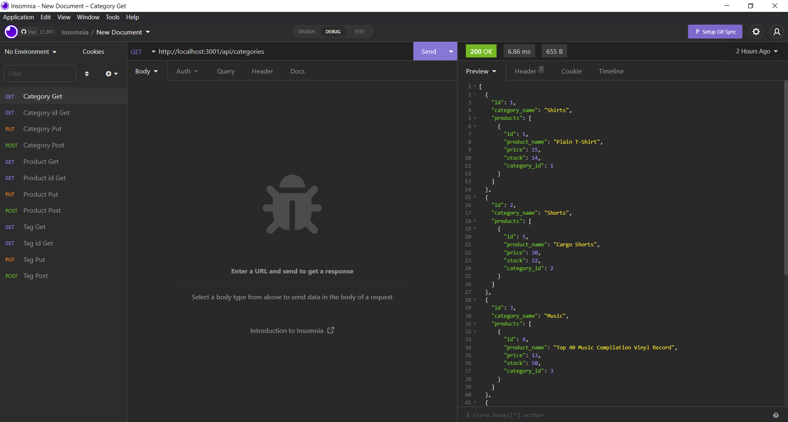
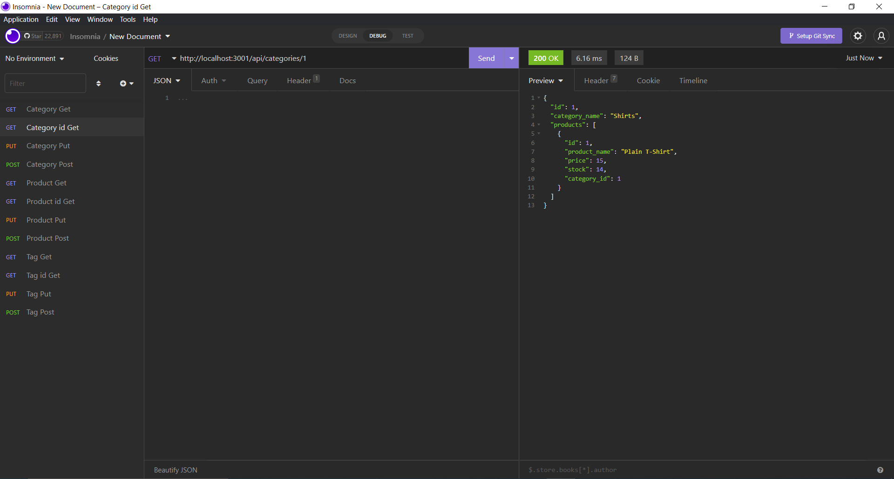
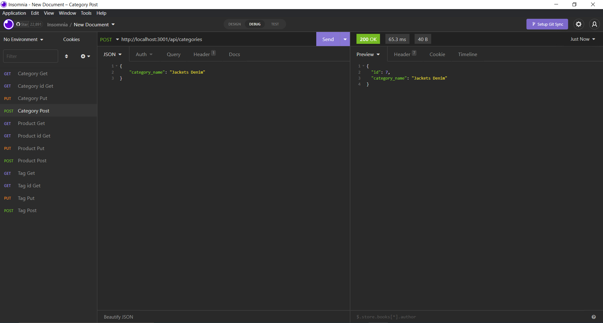
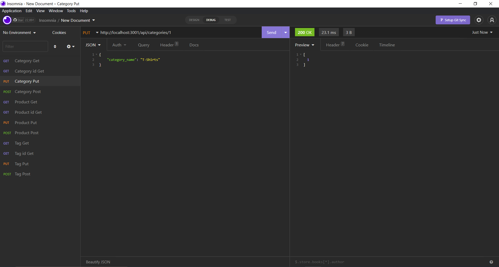
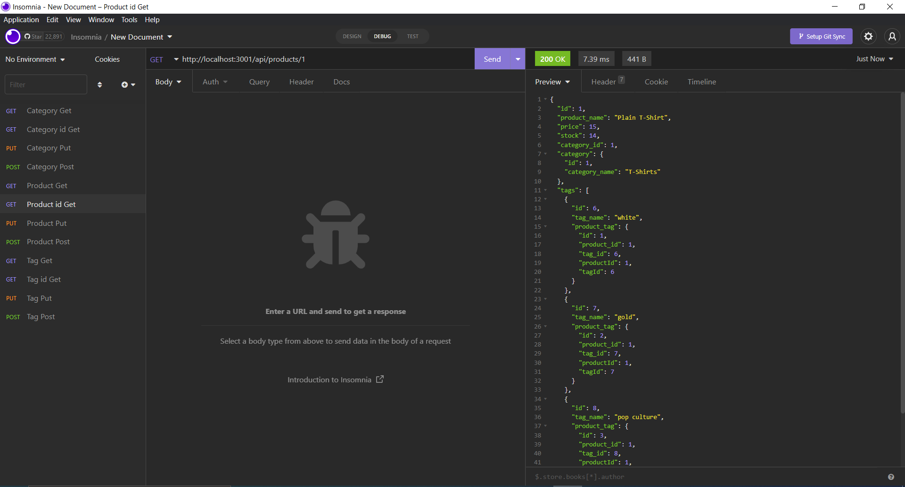
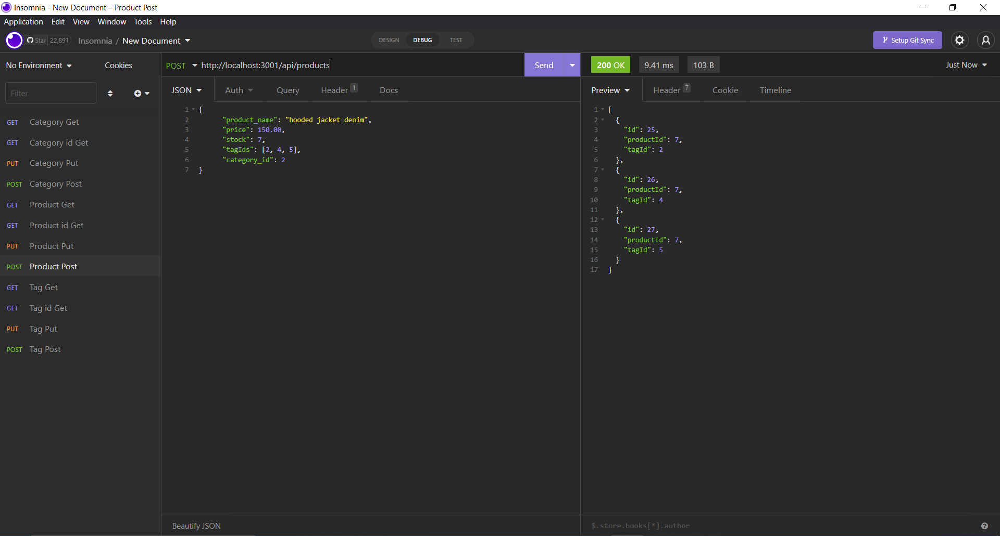
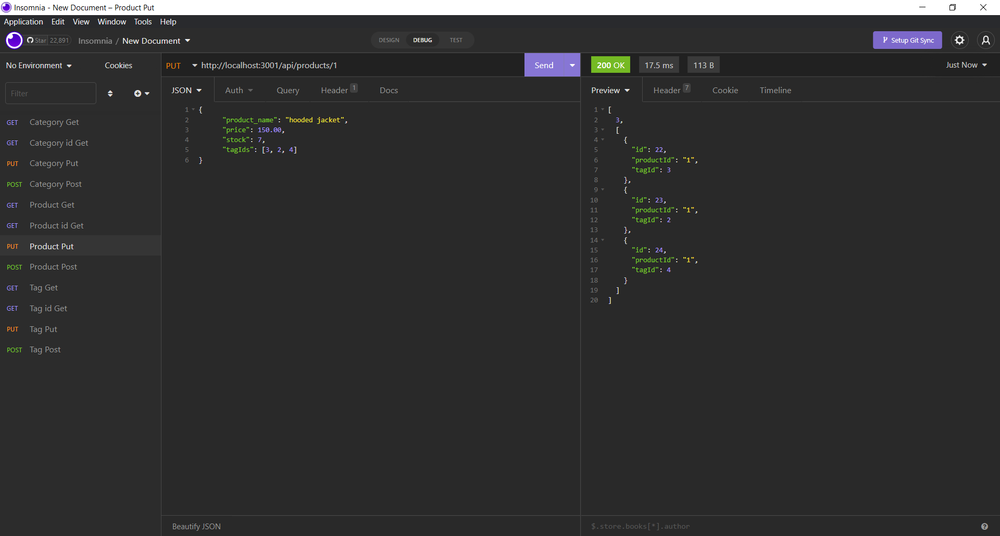
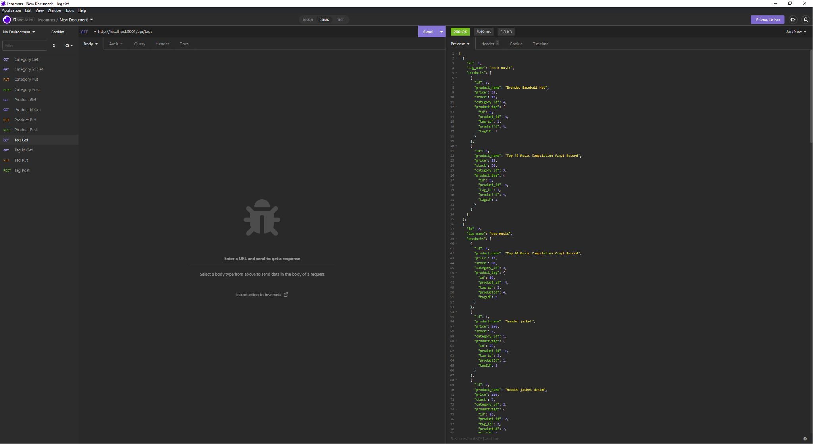
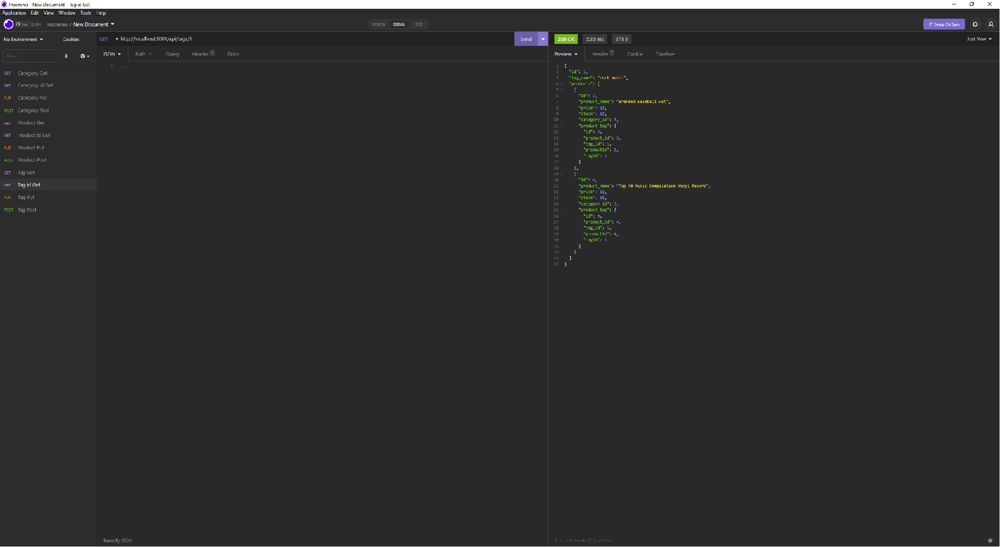
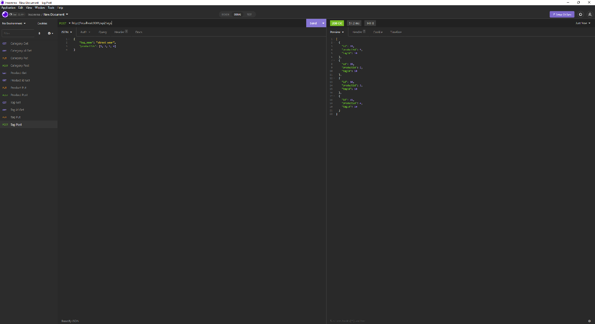

# E-commerce Back End 

## Description

This is an application that interfaces with a MySQL database using sequelizer.
There are 3 main tables, Categories, Products and Tags.

 - A category can have many Products.
 - A Product can have many Tags
 - A Tag can be against many Products.


<br>

## Table of Contents

- [GitHub Link](#link)
- [Installation Instructions](#install-instructions)
- [Executing Instructions](#executing-instructions)
- [Database Information](#database-information)
- [Express API Information](#express-api-information)
- [Video Demo](#video-demo)
- [Screen Shots](#screen-shots)
---

## Link

The link to the GitHub repository of the assignment is <br>
[https://github.com/jkoufalas/Employee-Tracker](https://github.com/jkoufalas/Employee-Tracker)

---

## Install Instructions

The dependancies are listed within the package.json file. The dependancies for this application are
 - sequelize
 - dotenv
 - mysql2

Since the dependancies are listed within the lock file, they will autmatically installed with the following command

```
npm i
```
---

## Executing Instructions

```
node index.js
```

Utilize the command prompts and the application will prompt you for any information it needs to fullfill the requests you have made.

---

## Database Information
The user must have a MySQL database installed on the machine they are running the application on.

The schema for the database is included in the db folder and can be included by running the command
```
mysql> source db/schema.sql
```

The seed data if required can be inserted into the database by using the index.js file in the seeds folder and inserted by running the command.
```
> node seeds/index.js
```

The information used to connect to the database is currently implemented with the dotenv package. To include the correct information to connect to the database corretly the following the user needs to create a .env file and add the following data.
```
    DB_NAME="ecommerce_db"
    DB_PW="your_password"
    DB_USER="your_user"
```
If the user doesn't want to use the dotenv package, then they can simply replace these variable in the server.js file with the hard coded values that these variables are storing.

---

## Express API Information

Express.js is used to interact to the database using the routes 
 - Get /api/categories, returns all categories
 - Get /api/categories/:id where the id is for a singular category id, returns a single category
 - Post /api/categories, creates a categories
 ```
    {
    "category_name": "Jackets"
    }
 ```
 - Put /api/categories/:id, modifies a category with id
 ```
    {
    "category_name": "Jackets"
    }
 ```
 - delete /api/categories/:id, deletes a category with id
 
 - Get /api/products, returns all products with categories and tags
 - Get /api/products/:id where the id is for a singular product id, returns a single product with categories and tags
 - Post /api/products, creates a product 
 ```
    {
      "product_name": "hooded jacket denim",
      "price": 150.00,
      "stock": 7,
      "tagIds": [2, 4, 5],
	  "category_id": 2
}
 ```
 - Put /api/products/:id, modifies a product with id
 ```
    {
      "product_name": "hooded jacket",
      "price": 150.00,
      "stock": 7,
      "tagIds": [3, 2, 4]
    }
 ```
 - delete /api/products/:id, deletes a products with id

 - Get /api/tags, returns all tags with products
 - Get /api/tags/:id where the id is for a singular product id, returns a single tag with products
 - Post /api/tags, creates a tag 
 ```
	{
      "tag_name": "street",
      "productIds": [1, 3, 4]
    }
 ```
 - Put /api/tags/:id, modifies a tag with id
 ```
    {
      "tag_name": "street",
      "productIds": [1, 3, 4]
    }
 ```
 - delete /api/tags/:id, deletes a tags with id


## Video Demo

[Link to Demo](https://youtu.be/vhIIxC-qzC0)

Select the 1080p option for better resolution of text.

The demonstration video covers the following. 
- The install instructions.
- How to run the application.
- A walkthrough of all the API calls for Categories, Products and Tags
---

## Screen Shots














---